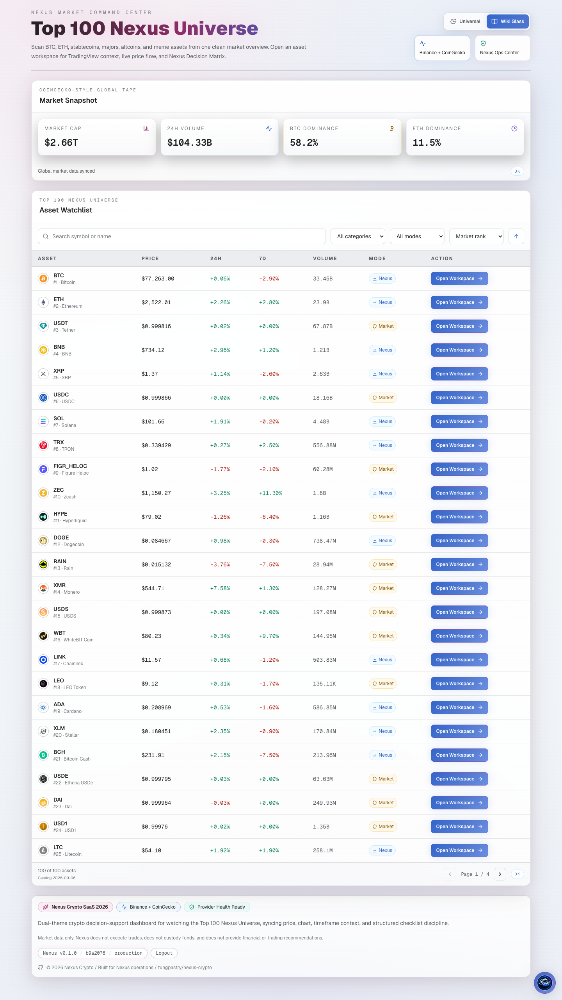
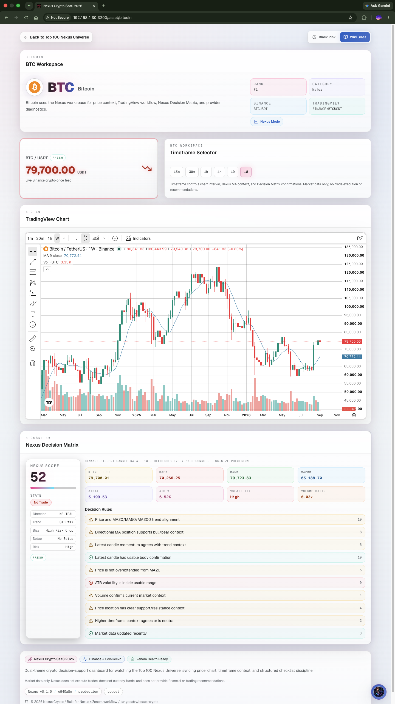
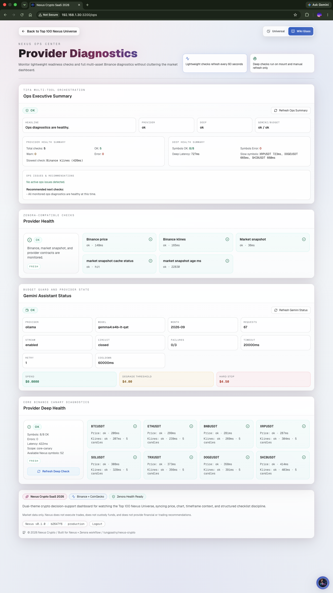
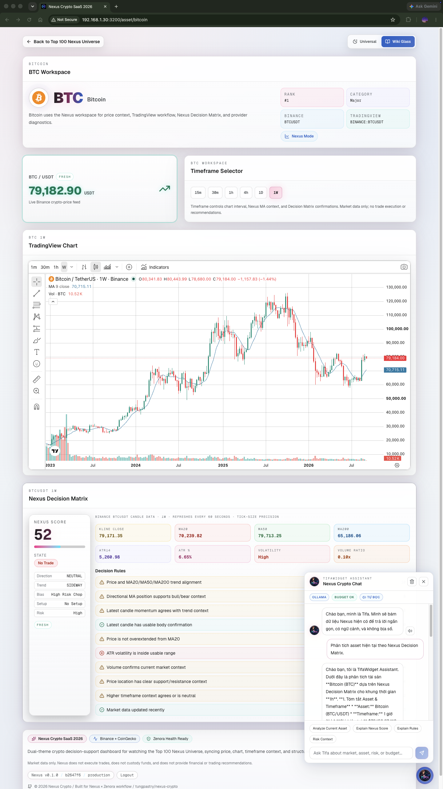

# Nexus Crypto SaaS 2026

<p align="center">
  
</p>

<p align="center">
  
  
  
  
  
</p>

Nexus Crypto is a retro financial dashboard for observing a versioned Top 100 crypto universe. It combines CoinGecko market snapshots, Binance Spot price and candle data, TradingView charts, the Nexus Decision Matrix, LAN authentication, operational diagnostics, and the grounded TifaWidget assistant.

Nexus Crypto is market-data-first decision-support software. It does not execute trades, custody funds, or provide financial or trading recommendations.

## Web App Screenshots

Screenshots show point-in-time market values and do not represent current prices.

### Home Dashboard



### Asset Workspace (BTC)



### Ops Dashboard



### Tifa Widget



## Current Verified Baseline

- Catalog: 100 committed CoinGecko members, version `2026-09-06-01628185553c`.
- Capabilities: 52 Binance Spot/USDT workspaces and 48 market-only workspaces.
- Deep health: 8 core Binance canaries, separate from the full 52-symbol allowlist.
- Price display: Binance `PRICE_FILTER.tickSize` precision for live prices and candle-derived matrix metrics.
- UI: persistent Black Pink and Wikipedia Glass themes.
- Assistant: Tifa Phase 2 orchestration with Ollama `gemma4:e4b-it-qat` as the current production provider, optional Gemini API support, and grounded tool-only fallback.
- Production reference: Ubuntu Server, Node `v22.18.0`, `nexus-crypto.service`, port `3200`.
- Framework: Next.js `16.3.4`, React `19.2.0`; current dependency baseline passes `npm audit` with zero known advisories.

## Table of Contents

- [Web App Screenshots](#web-app-screenshots)
- [Current Verified Baseline](#current-verified-baseline)
- [Features](#features)
- [Architecture](#architecture)
- [Tech Stack](#tech-stack)
- [Prerequisites](#prerequisites)
- [Quick Start](#quick-start)
- [Validation](#validation)
- [Production Deployment On Ubuntu](#production-deployment-on-ubuntu)
- [Tifa LLM Providers](#tifa-llm-providers)
- [API Overview](#api-overview)
- [Documentation](#documentation)
- [Project Structure](#project-structure)
- [Roadmap](#roadmap)
- [Contributing](#contributing)
- [License](#license)
- [Author](#author)

## Features

- Versioned Top 100 market overview with search, category/mode filters, live metric sorting, and 25-row pagination.
- Per-asset workspace at `/asset/[id]` with responsive chart, price, timeframe, and decision-support surfaces.
- 52 catalog assets verified against active Binance Spot/USDT markets; 48 assets use explicit market-only behavior.
- Binance prices rendered with committed exchange `tickSize` precision; no runtime `exchangeInfo` request is needed.
- CoinGecko snapshot with catalog metadata, bounded retry, in-memory cache, persistent fallback, and stale status.
- Nexus Algorithm v1.1 with MA20/MA50/MA200 structure, ATR14, volume confirmation, support/resistance context, optional higher-timeframe agreement, risk, score, and workflow state.
- Stablecoin and Binance-unavailable modes that avoid unsupported chart, candle, and decision-matrix calls.
- Lightweight provider readiness plus manual eight-canary deep health diagnostics on `/ops`.
- LAN-local auth with signed HTTP-only sessions, login rate limiting, rotation, and smoke bearer auth.
- Persistent Black Pink and Wikipedia Glass themes across Home, Asset, Ops, Login, TifaWidget, and TradingView.
- TifaWidget on Home, Asset, and Ops with SSE streaming, allowlisted tool orchestration, per-page browser history, and optional Web Speech text-to-speech.
- Ollama and Gemini provider adapters with retry, timeout, circuit breaker, redaction, and tool-only degradation.
- Release metadata via `/api/version`, an Ubuntu `systemd` deploy script, smoke gates, and GitHub Actions CI.

## Architecture

```text
Browser UI
  -> Next.js App Router pages and route handlers
  -> catalog-gated Binance / CoinGecko provider clients
  -> in-memory cache and persistent market-snapshot fallback
  -> dashboard, asset workspace, ops diagnostics, and Tifa contexts
```

The committed catalog is the capability boundary. Binance-enabled assets receive live ticker/candle workflows; stablecoins and assets without a verified Binance Spot/USDT pair remain market-only. The default health route is lightweight, while the deep route deliberately checks only eight core canaries.

Tifa resolves an intent, selects tools from a strict allowlist, builds grounded context, and calls the configured provider. A provider error falls back to a local tool-only answer; the gateway does not automatically switch from Ollama to Gemini or vice versa.

See [Architecture](docs/architecture.md), [Asset Catalog](docs/asset-catalog.md), [Nexus Algorithm](docs/nexus-algorithm.md), and [Tifa Assistant](docs/tifa-assistant.md).

## Tech Stack

- Next.js `16.3.4` App Router and React `19.2.0`
- TypeScript 5 and Tailwind CSS v4
- Axios `1.20.x`
- Framer Motion and Lucide React
- Vitest `4.1.6` and ESLint 9
- TradingView Widget
- Binance Spot REST and CoinGecko markets/global APIs
- Optional Ollama or Gemini LLM provider
- Ubuntu Server, Node 22 LTS, npm, and `systemd`

## Prerequisites

- Node.js 22 LTS recommended (production reference uses `v22.18.0`).
- npm with the committed `package-lock.json`.
- Optional production host: Ubuntu Server with `systemd`.
- Optional assistant provider: reachable Ollama host or a server-side Gemini API key.

## Quick Start

Local development uses `npm install`:

```bash
git clone https://github.com/tungpastry/nexus-crypto.git
cd nexus-crypto
npm install
npm run dev
```

Open `http://localhost:3200`. Copy required non-secret keys from `.env.example` into an ignored local env file. Production and release validation use `npm ci`, not `npm install`.

## Validation

```bash
git diff --check
npm run assets:check
npm run lint
npm run test
npm run build
npm audit
```

Runtime smoke tests require a running app. When auth is enabled, pass the smoke token through the environment without printing it:

```bash
NEXUS_CRYPTO_BASE_URL="http://127.0.0.1:3200" \
./scripts/smoke_crypto_assets_contract.sh

NEXUS_CRYPTO_BASE_URL="http://127.0.0.1:3200" \
npm run smoke:tifa
```

## Production Deployment On Ubuntu

The preferred deploy path is [`scripts/deploy_ubuntu_server.sh`](scripts/deploy_ubuntu_server.sh). It performs a dirty-tree guard, fast-forward pull, release metadata injection, `npm ci`, audit, lint/test/build, service restart, readiness/version checks, crypto smoke, and a final clean-tree check.

```bash
cd /home/nexus/projects/nexus-crypto

NEXUS_CRYPTO_REPO_DIR="/home/nexus/projects/nexus-crypto" \
NEXUS_CRYPTO_BASE_URL="http://127.0.0.1:3200" \
NEXUS_CRYPTO_SERVICE="nexus-crypto.service" \
NEXUS_CRYPTO_BRANCH="main" \
./scripts/deploy_ubuntu_server.sh
```

Run the Tifa smoke separately with production environment variables available to the command. Never print `.env.production.local`, `NEXUS_SMOKE_AUTH_TOKEN`, or provider credentials.

Full instructions: [Deployment](docs/deployment.md) and [Release Checklist](docs/release-checklist.md).

## Tifa LLM Providers

The provider is selected server-side with `TIFA_LLM_PROVIDER=ollama|gemini`.

- **Ollama** is the current production primary. The documented model is `gemma4:e4b-it-qat`; inference is local and bypasses the Gemini cost ledger.
- **Gemini API** remains optional. Its server-side API key, monthly budget guard, streaming controls, retry limits, and circuit breaker remain supported.
- **Tool-only** is the grounded fallback when the selected provider is unavailable, unconfigured, blocked, or fails before producing a usable response.
- There is no automatic cross-provider failover. Change the configured provider and restart the service to switch providers.

Use the canonical active-provider health endpoint:

```bash
curl -sS http://127.0.0.1:3200/api/provider-health/llm | python3 -m json.tool
```

The `/api/provider-health/ollama` and `/api/provider-health/gemini` routes remain compatibility health surfaces. Their payload reflects the currently active provider snapshot; use `/llm` for provider-neutral operations.

## API Overview

Public operational endpoints:

- `GET /api/version`
- `GET /api/provider-health`
- `GET /api/provider-health/deep`
- `GET /api/provider-health/llm`
- `GET /api/provider-health/ollama`
- `GET /api/provider-health/gemini`
- `/api/auth/login`, `/api/auth/logout`, `/api/auth/me`

Protected by session or smoke bearer token when auth is enabled:

- `GET /api/crypto-price`
- `GET /api/crypto-klines`
- `GET /api/market-snapshot`
- legacy `GET /api/btc-price` and `GET /api/btc-klines`
- `POST /api/tifa` and `POST /api/tifa/stream`
- Tifa context, explainer, summary, budget, and orchestration routes under `/api/tifa-tools/*`

See [API Reference](docs/api-reference.md) for contracts and failure behavior.

## Documentation

- [Documentation Index](docs/index.md)
- [Architecture](docs/architecture.md)
- [Asset Catalog](docs/asset-catalog.md)
- [Nexus Algorithm](docs/nexus-algorithm.md)
- [Tifa Assistant](docs/tifa-assistant.md)
- [API Reference](docs/api-reference.md)
- [Deployment](docs/deployment.md)
- [Troubleshooting](docs/troubleshooting.md)
- [LAN Local Authentication](docs/auth-lan-local.md)
- [Release Checklist](docs/release-checklist.md)
- [Tifa Phase 1 History](docs/tifa-assistant-phase1.md)
- [Tifa Phase 2 History](docs/tifa-assistant-phase2.md)

## Project Structure

```text
nexus-crypto/
|-- .github/workflows/ci.yml
|-- app/
|   |-- api/
|   |-- asset/[id]/page.tsx
|   |-- components/
|   |-- config/assets.generated.json
|   |-- config/assets.ts
|   |-- lib/nexusAlgorithm.ts
|   |-- lib/priceFormat.ts
|   |-- lib/tifa-core/
|   |-- lib/tifa-provider-gateway/
|   |-- lib/tifa-tools/
|   |-- ops/page.tsx
|   `-- page.tsx
|-- docs/
|-- prompts/TIFA_NEXUS_CRYPTO_RUNTIME.md
|-- public/screenshots/
|-- scripts/
|-- proxy.ts
|-- CONTRIBUTING.md
|-- LICENSE
`-- package.json
```

Generated runtime files under `runtime/` and `.runtime/` are ignored and must not be committed.

## Roadmap

- Add bounded TTL caching for expensive ops-summary orchestration.
- Surface orchestration warnings more explicitly in `/ops`.
- Add broader chat intent-to-tool integration coverage.
- Establish a reviewed cadence for refreshing the committed Top 100 catalog.
- Add provider-neutral health naming internally while preserving compatibility routes.
- Optional Cloudflare Tunnel HTTPS deployment profile.

## Contributing

Please read [CONTRIBUTING.md](CONTRIBUTING.md) before opening a pull request.

## License

This project is licensed under the [MIT License](LICENSE).

## Author

- GitHub: [tungpastry](https://github.com/tungpastry)
